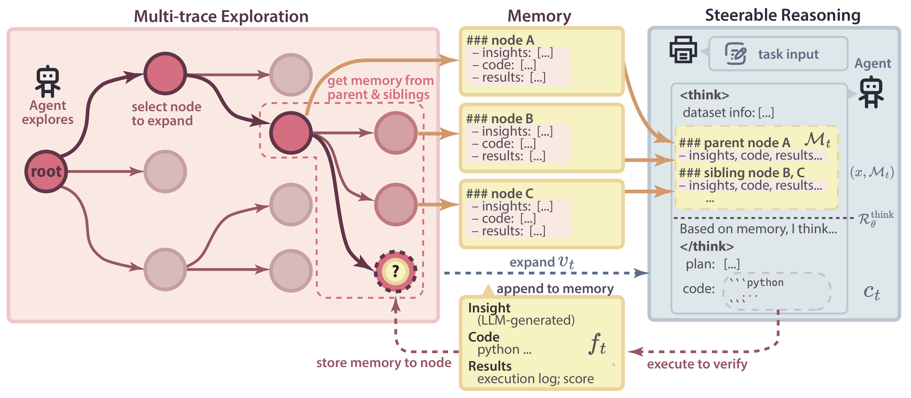
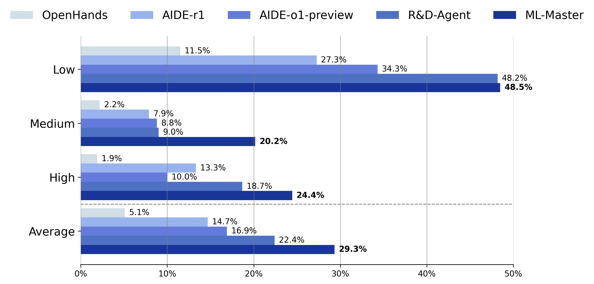
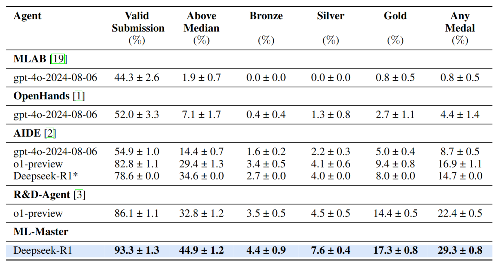
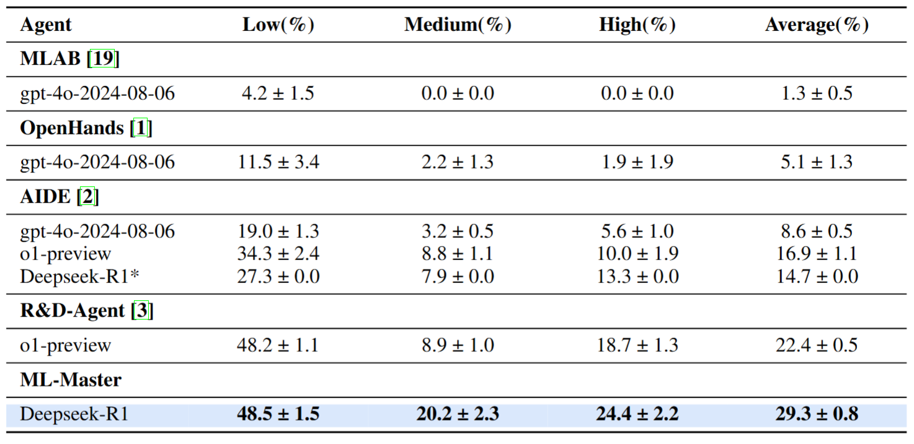
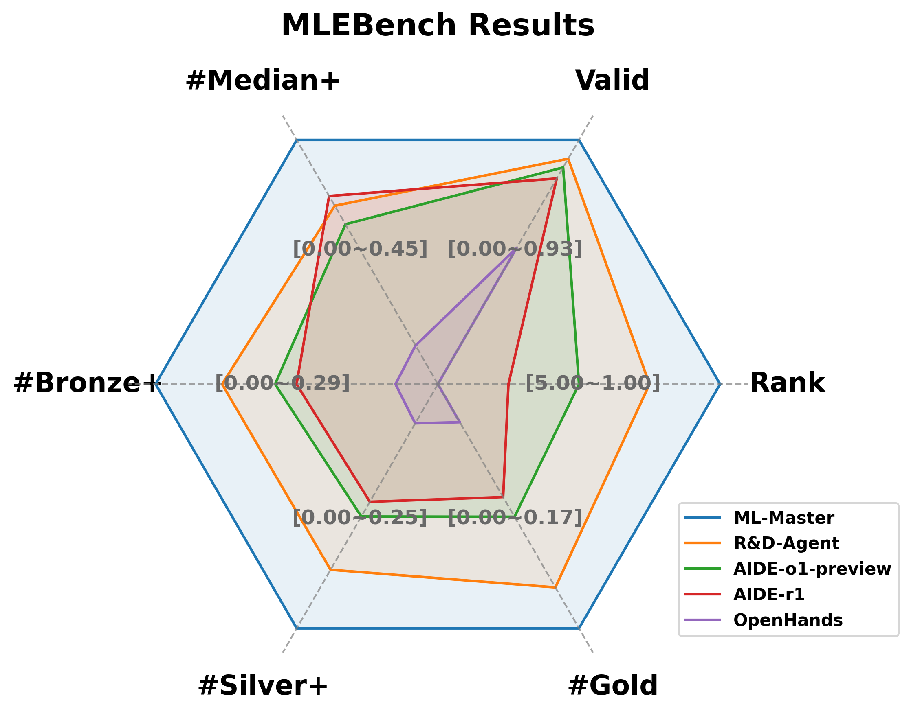
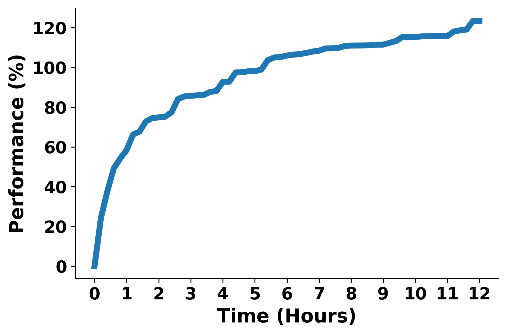

# ML-Master: Towards AI-for-AI via Intergration of Exploration and Reasoning

> **Status**: 🔬 Manuscript | ⌛ Code Coming Soon

## 🚀 Overview

**ML-Master** is a novel AI4AI (AI-for-AI) agent that integrates exploration and reasoning into a coherent iterative methodology, facilitated by an adaptive memory mechanism that selectively captures and summarizes relevant insights and outcomes, ensuring each component mutually reinforces the other without compromising either. 

## 📰 What's New
- [2025/06/17] Release the initial version! See the initial manuscript [here](./assets/ML-Master_github.pdf).

## 📊 Performance Highlights

ML-Master outperforms prior baselines on the **[MLE-Bench](https://github.com/openai/mle-bench)**:

| Metric                      | Result                |
|----------------------------|-----------------------|
| 🥇 Average Medal Rate       | **29.3%**             |
| 🧠 Medium Task Medal Rate   | **20.2%**, more than doubling the previous SOTA            | 
| 🕒 Runtime Efficiency        | **12 hours**, 50% budget |

## 📆 Coming Soon
- [x] Grading report release
- [ ] Paper release of ML-Master
- [ ] Code release of ML-Master

<!-- 

<table>
  <tr>
    <td></td>
    <td></td>
  </tr>
</table> -->